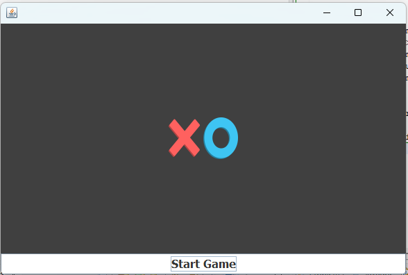
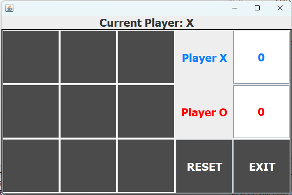
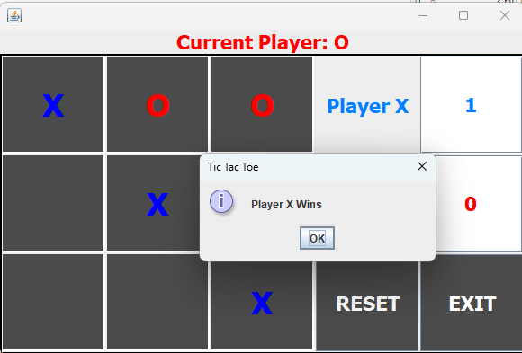
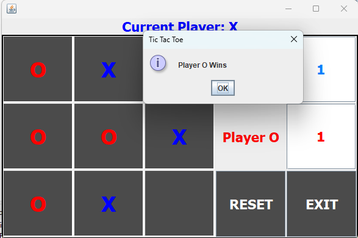
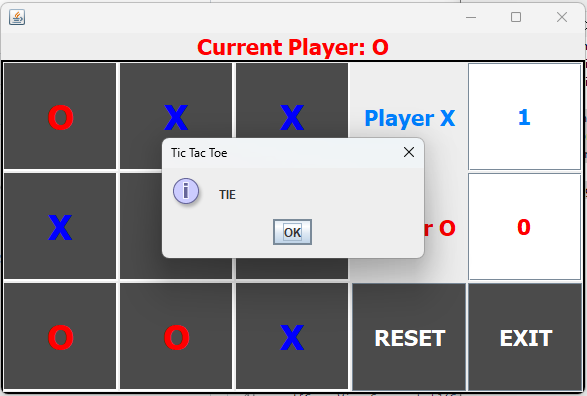
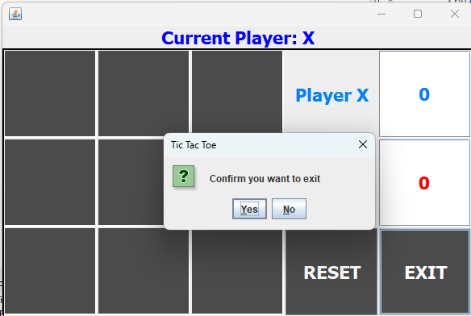
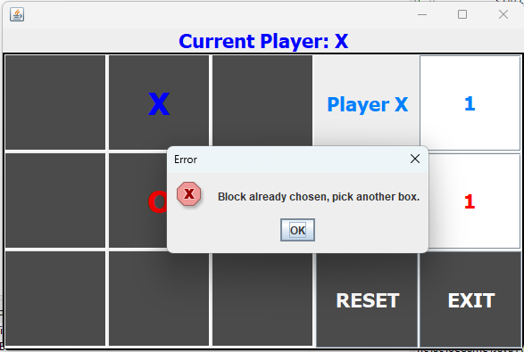

# TicTacToeGame

Tic Tac Toe is a classic, two-player game where one player is 'X' and the other player is 'O'. The game is played on a grid that's 3 squares by 3 squares.

## How the Game Works

1. The game starts with Player X. Each player takes turns to put their mark in empty squares.
2. The first player to get 3 of their marks in a row (up, down, across, or diagonally) is the winner.
3. If all 9 squares are full and no player has 3 marks in a row, the game is a draw.

In this implementation of the game, the players take turns by entering the number of the grid space where they want to place their mark. The game checks after each turn to see if there's a winner.

## Screenshots
 

## Features

1. **Two-player mode**: The game allows two players to play against each other, with one player as 'X' and the other as 'O'.
1. **Graphical user interface**: The game uses Java Swing to provide a graphical user interface, making it easy to play the game with clicks of a button.
1. **Current Player Display**: The game displays the current player's turn (either 'X' or 'O') on the top of the game window.
1. **Win Detection**: The game automatically checks for a win condition after each move. A player wins by placing three of their marks in a horizontal, vertical, or diagonal row.

1. **Score Keeping**: The game keeps track of how many games each player has won during the session.
1. **Reset Function**: Players can reset the game board at any time while maintaining the score with the "RESET" button.
1. **Exit Button**: Players can choose to exit the game at any time by clicking on the "EXIT" button.

1. **Error Handling**: The game prevents players from making invalid moves, such as placing a mark in an already occupied block.

## Installation and Usage

This game is a simple Java application. Ensure you have Java and Eclipse (or another Java IDE) installed on your machine.

To run the game, clone this repository and import it into your Java IDE:

1. Clone the repository: `git clone https://github.com/yourusername/TicTacToeGame.git`
2. In Eclipse, choose File > Import > General > Existing Projects into Workspace.
3. Select the `TicTacToeGame` directory that you cloned.
4. Click Finish to complete the import.
5. Run the `TicTacToeGame.java` file to start the game.

After launching the game, players take turns clicking on the grid squares. Player X starts the game. The game automatically switches between Player X and Player O after each move. The aim is to get 3 of your marks in a row, column, or diagonal. If all squares are filled and no player has achieved 3 marks in a row, the game is a draw.

Click the "RESET" button to clear the game board and start a new game, keeping the current scores. Click the "EXIT" button to close the game.

## Built With

- [Java](https://www.java.com/) - The programming language used.
- [Eclipse](https://www.eclipse.org/) - The IDE used for development.
